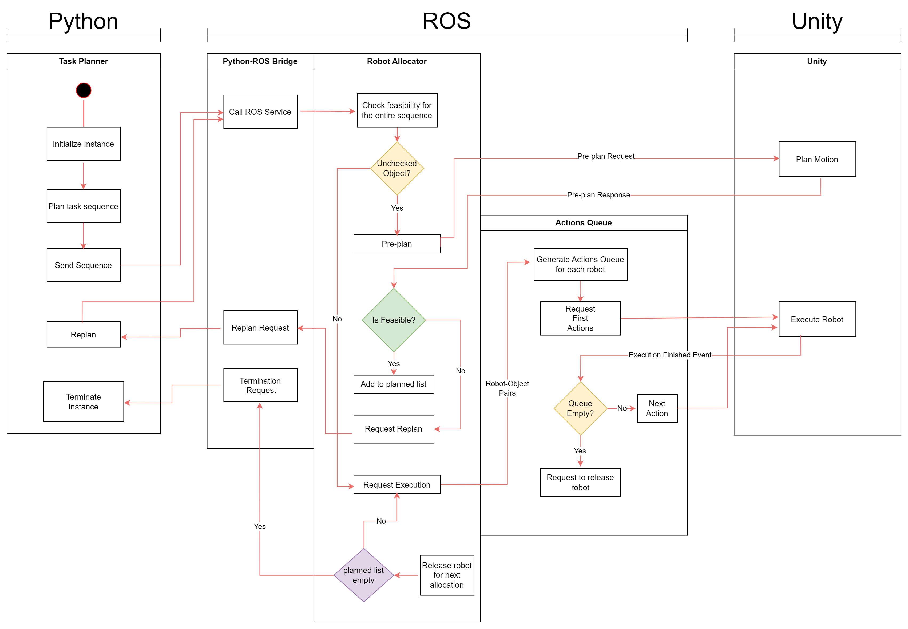

# Coordination of two robotic manipulators for object retrieval in clutter

More components are to be added.

## Simulator Overview

### System Scheme



View the [scheme PDF](docs/scheme.pdf) for a detailed version.

- **Task Planner**
  - Initiates scene instance, robots, and other scene factors.
  - Plans or replans relocation sequence.

- **Robot Allocator**
  - Checks feasibility of task sequence with Unity and requests replan if needed.
  - Allocates an object to a robot.

- **Actions Queue**
  - Generates full sequence of actions for requested robot-object pair.
  - Requests execution to Unity one action at a time.

- **Unity Simulator**
  - Checks feasibility of motion for a requested task.
  - Moves robots as requested.
  - Provides collision-avoiding navigation using Unity's NavMesh.
  - Periodically publishes robot poses in a ROS topic.

## Prerequisites

- **ros_tcp_endpoint**

  ROS package to bridge ROS and Unity Robotics Hub.

  ```bash
  cd ~/catkin_ws/src
  git clone https://github.com/Unity-Technologies/ROS-TCP-Endpoint.git
  cd ~/catkin_ws && catkin_make


## Citation

Ahn, Jeeho, ChangHwan Kim, and Changjoo Nam. "[Coordination of two robotic manipulators for object retrieval in clutter](https://ieeexplore.ieee.org/abstract/document/9811978)." 2022 International Conference on Robotics and Automation (ICRA). IEEE, 2022.